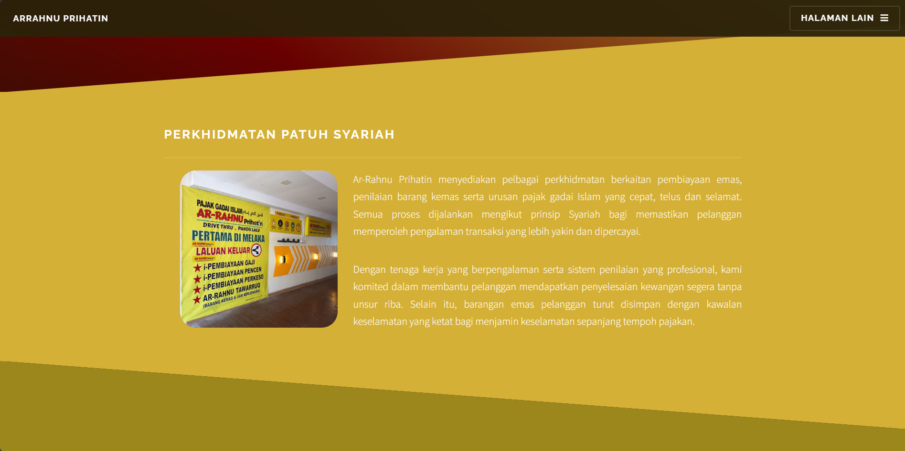
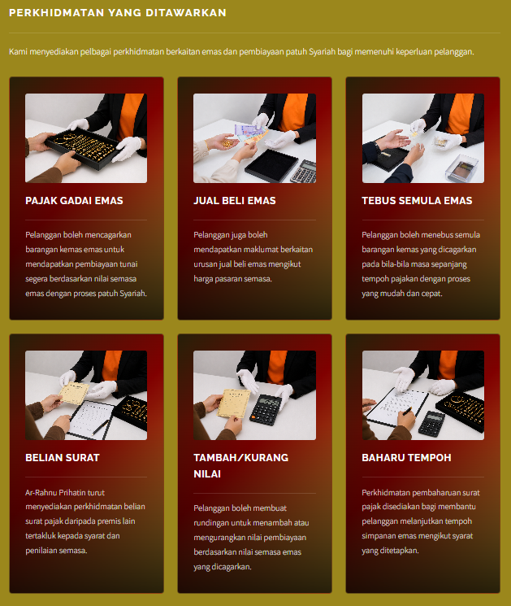
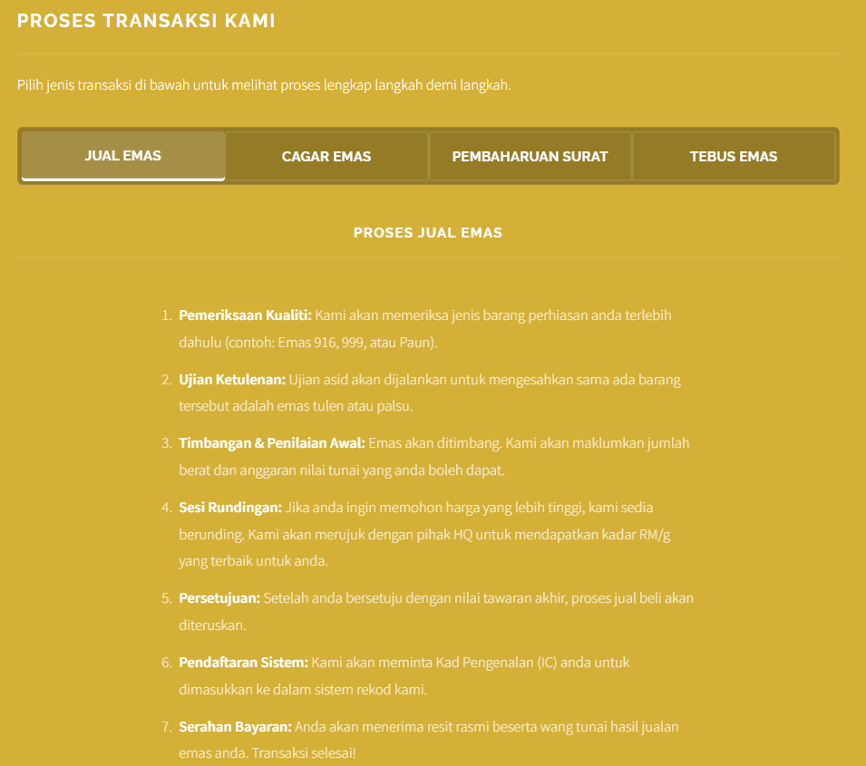
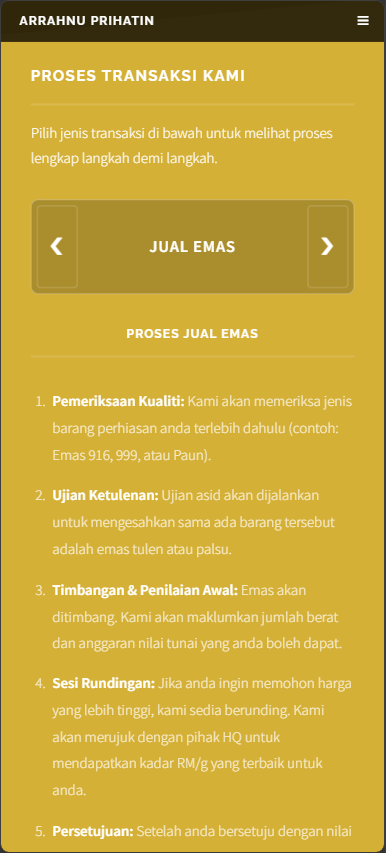
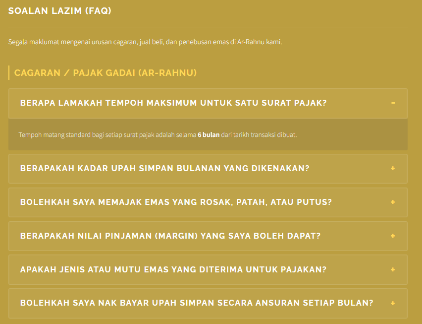

# 04-02 Halaman Perkhidmatan

## 1. Pengenalan

Halaman Perkhidmatan merupakan halaman khusus yang dibangunkan bagi menerangkan secara terperinci senarai perkhidmatan yang ditawarkan oleh Ar-Rahnu Prihatin. Halaman ini bukan sahaja memaparkan jenis-jenis perkhidmatan seperti pajak gadai emas dan jual beli emas, malah turut menyediakan panduan proses transaksi langkah demi langkah serta ruangan Soalan Lazim (FAQ) untuk kemudahan pelanggan.

Pembangunan halaman ini memfokuskan kepada penyampaian maklumat yang interaktif dan mudah difahami. Oleh itu, elemen seperti *Tab Navigation* untuk aliran proses dan *Accordion* untuk FAQ telah diimplementasi menggunakan JavaScript bagi memberikan pengalaman pengguna (UX) yang lebih kemas tanpa membebankan paparan visual.

---

## 2. Objektif Pembangunan

Objektif pembangunan halaman Perkhidmatan adalah seperti berikut:

1. Menyenaraikan perkhidmatan patuh Syariah yang ditawarkan dengan jelas.
2. Menyediakan panduan langkah demi langkah bagi setiap jenis transaksi (Jual, Cagar, Baharu, Tebus).
3. Membangunkan antaramuka responsif yang berbeza antara desktop dan telefon pintar untuk aliran proses.
4. Menjawab persoalan umum pelanggan melalui ruangan Soalan Lazim (FAQ) yang interaktif.
5. Mengekalkan identiti korporat dan reka bentuk visual yang konsisten.

---

## 3. Struktur Fail Digunakan

```text
service.html
assets/css/main.css
assets/js/main.js
images/Perkhidmatan/
```

Keterangan:

* `service.html` → Halaman utama untuk perkhidmatan.
* `main.css` → Fail gaya utama yang mengandungi kelas khusus untuk kad perkhidmatan dan struktur tab.
* `main.js` → Mengandungi logik JavaScript untuk pertukaran tab dan animasi FAQ.
* `images/Perkhidmatan/` → Direktori penyimpanan gambar ilustrasi perkhidmatan.

---

## 4. Pembangunan Struktur HTML

### 4.1 Banner dan Pengenalan Perkhidmatan

Seksyen ini bertindak sebagai pengenalan utama sebaik sahaja pengguna menavigasi ke halaman ini. Ia menggunakan komponen css `spotlight style1`.

Kod:

```html
<section id="banner">
    <div class="inner">
        <h2>Perkhidmatan</h2>
        <p>Penyelesaian kewangan segera melalui pajak gadai Islam yang selamat, telus dan pantas.</p>
    </div>
</section>

<section id="intro-service" class="wrapper spotlight style1">
    <div class="inner">
        <div class="content">
            <h2 class="major">Perkhidmatan Patuh Syariah</h2>
            <span class="image left service-slideshow">
                
            </span>
            <p>Ar-Rahnu Prihatin menyediakan pelbagai perkhidmatan berkaitan pembiayaan emas...</p>
        </div>
    </div>
</section>
```

#### Paparan Pengenalan Perkhidmatan


---

### 4.2 Seksyen Kad Senarai Perkhidmatan

Sebanyak enam (6) jenis perkhidmatan dipaparkan menggunakan grid sistem yang responsif.

Kod struktur:

```html
<section class="features-services">
    <article>
        <a class="image"></a>
        <h3 class="major">Pajak Gadai Emas</h3>
        <p>Pelanggan boleh mencagarkan barangan kemas emas untuk mendapatkan pembiayaan tunai...</p>
    </article>
    </section>

```

#### Paparan Kad Perkhidmatan


---

### 4.3 Seksyen Aliran Proses Transaksi (Tab Interaktif)

Bahagian ini paling kritikal kerana ia menggunakan dua susun atur yang berbeza. Untuk pengguna komputer (PC), menu berbentuk *Tab* digunakan, manakala untuk telefon pintar, butang *Anak Panah (Arrow)* digunakan.

Kod:

```html
<section id="process" class="wrapper alt style2">
    <div class="inner">
        <h2 class="major">Proses Transaksi Kami</h2>

        <div class="mobile-tab-nav">
            <button class="nav-arrow" onclick="shiftTab(-1)">&#10094;</button>
            <div id="mobile-tab-label">Jual Emas</div>
            <button class="nav-arrow" onclick="shiftTab(1)">&#10095;</button>
        </div>

        <div class="tab-container pc-only">
            <button class="tab-links active" onclick="openFlow(event, 'Jual')">Jual Emas</button>
            <button class="tab-links" onclick="openFlow(event, 'Cagar')">Cagar Emas</button>
            <button class="tab-links" onclick="openFlow(event, 'Renew')">Pembaharuan Surat</button>
            <button class="tab-links" onclick="openFlow(event, 'Tebus')">Tebus Emas</button>
        </div>

        <div id="Jual" class="tab-content" style="display: block;">
            <h3 class="major">Proses Jual Emas</h3>
            <ol class="process-list">
                <li><strong>Pemeriksaan Kualiti:</strong> Kami akan memeriksa jenis barang...</li>
            </ol>
        </div>
    </div>
</section>
```

#### Paparan Proses Transaksi (Dekstop)


#### Paparan Proses Transaksi (Mobile)


---

### 4.4 Seksyen Soalan Lazim (FAQ Accordion)

Dibangunkan untuk memudahkan pengguna mencari jawapan asas tanpa perlu menghubungi pihak khidmat pelanggan.

Kod:

```html
<section id="four" class="wrapper alt style3">
    <div class="inner">
        <h2 class="major">Soalan Lazim (FAQ)</h2>
        <div class="faq-accordion">
            <div class="faq-group">
                <h3 class="faq-category-title">Cagaran / Pajak Gadai (Ar-Rahnu)</h3>
                <div class="faq-item">
                    <button class="faq-question">Berapa lamakah tempoh maksimum untuk satu surat pajak?</button>
                    <div class="faq-answer">
                        <p>Tempoh matang standard bagi setiap surat pajak adalah selama <strong>6 bulan</strong>...</p>
                    </div>
                </div>
            </div>
        </div>
    </div>
</section>
```

#### Paparan Soalan Lazim


---

## 5. Pengubahsuaian CSS

### 5.1 Penyesuaian Imej Pengenalan

Bagi memastikan imej berbentuk kotak (segi empat sama) dan bucu bulat, kod khusus diletakkan pada kelas `.service-slideshow`.

Kod:

```css
.image.service-slideshow {
    width: 15em !important;
    height: 15em !important; 
    aspect-ratio: 1 / 1 !important;
    border-radius: 1.5em !important; 
    margin-right: 3em !important; 
}
.image.service-slideshow img {
    object-fit: cover !important;
}
```

### 5.2 Grid Responsif Kad Perkhidmatan

Kad disusun secara fleksibel bergantung pada saiz skrin peranti pengguna. Animasi *hover* dan kesan kerdipan (*glitter*) turut dimasukkan.

Kod:

```css
.features-services {
    display: flex;
    flex-wrap: wrap;
    gap: 1.5em;
}

.features-services article {
    width: calc(33.333% - 1em);
    background-image: linear-gradient(135deg, #2a2209 0%, #8B0000 45%, #D4AF37 100%);
    transition: all 0.3s ease;
}

@media screen and (max-width: 980px) {
    .features-services article { width: calc(50% - 0.75em); }
}

@media screen and (max-width: 736px) {
    .features-services article { width: 100%; }
}
```

### 5.3 Reka Bentuk Tab Proses Interaktif

Bagi menyembunyikan Tab di telefon dan memaparkan Anak Panah, fungsi *Media Query* digunakan sepenuhnya.

Kod:

```css
.tab-container.pc-only {
    display: flex;
    flex-wrap: nowrap; /* Paksa 1 baris */
    background: rgba(0, 0, 0, 0.3);
}

.mobile-tab-nav {
    display: none; 
}

@media screen and (max-width: 736px) {
    .pc-only { display: none !important; }
    .mobile-tab-nav { display: flex; }
}
```

---

## 6. Pengaturcaraan JavaScript

Fungsi interaktif dalam halaman ini diaktifkan menggunakan JavaScript khusus.

### 6.1 Logik Penukaran Tab (Desktop & Mobile)

Satu fungsi dibina agar kedua-dua butang (Tab di PC dan Anak Panah di Telefon) membaca *array* yang sama.

Kod:

```javascript
const tabOrder = ['Jual', 'Cagar', 'Renew', 'Tebus'];
let currentTabIndex = 0;

// Fungsi untuk klik Tab Desktop
function openFlow(evt, flowName) {
    var tabcontent = document.getElementsByClassName("tab-content");
    for (let i = 0; i < tabcontent.length; i++) tabcontent[i].style.display = "none";
    
    // Paparkan content yang dipilih
    document.getElementById(flowName).style.display = "block";
    currentTabIndex = tabOrder.indexOf(flowName);
}

// Fungsi untuk klik Arrow Mobile
function shiftTab(direction) {
    currentTabIndex += direction;
    // Loop sistem 
    if (currentTabIndex >= tabOrder.length) currentTabIndex = 0;
    if (currentTabIndex < 0) currentTabIndex = tabOrder.length - 1;

    const newFlow = tabOrder[currentTabIndex];
    document.getElementById(newFlow).style.display = "block";
}
```

### 6.2 Logik Accordion FAQ

Kod:

```javascript
document.addEventListener('DOMContentLoaded', function() {
    const faqQuestions = document.querySelectorAll('.faq-question');
    faqQuestions.forEach(question => {
        question.addEventListener('click', () => {
            const faqItem = question.parentElement;
            const faqAnswer = question.nextElementSibling;

            faqItem.classList.toggle('active');
            if (faqItem.classList.contains('active')) {
                faqAnswer.style.maxHeight = faqAnswer.scrollHeight + "px";
            } else {
                faqAnswer.style.maxHeight = null;
            }
        });
    });
});
```

Fungsi: Membuka dan menutup jawapan FAQ secara animasi apabila soalan diklik.

---

## 7. Ujian Sistem

Ujian telah dijalankan pada halaman ini untuk memastikan setiap fungsi interaktif beroperasi tanpa ralat.

| No | Jenis Ujian | Hasil Ujian |
| --- | --- | --- |
| 1 | Imej pengenalan dipaparkan dalam bentuk kotak 1:1 | Berjaya |
| 2 | Kad perkhidmatan menjadi 1 kolum pada skrin telefon | Berjaya |
| 3 | Menu Tab Proses disembunyikan pada versi mobile | Berjaya |
| 4 | Butang anak panah berfungsi menukar kandungan proses (Mobile) | Berjaya |
| 5 | Teks proses transaksi selari di bahagian kiri | Berjaya |
| 6 | Klik pada soalan FAQ berjaya memaparkan jawapan penuh | Berjaya |

---

## 8. Masalah dan Penyelesaian

### Isu 1: Butang Tab Melebihi Pada Skrin Telefon

**Masalah:** Susun atur 4 butang tab (`tab-links`) kelihatan bersesak dan turun ke barisan kedua pada skrin telefon yang kecil.
**Penyelesaian:** Membina elemen baru iaitu `.mobile-tab-nav` yang menggunakan butang anak panah (Kiri & Kanan), serta menggunakan CSS `@media screen` untuk menyembunyikan tab desktop (`.pc-only`) di peranti mudah alih.

### Isu 2: Gambar Pengenalan Menjadi Lonjong

**Masalah:** Pada resolusi tertentu, gambar di `.service-slideshow` menjadi lonjong (tertarik) disebabkan sistem responsif *flexbox*.
**Penyelesaian:** Memasukkan elemen `aspect-ratio: 1 / 1 !important` beserta `object-fit: cover !important` dan menambah `flex-shrink: 0;` bagi menghalang *flexbox* daripada memampatkan imej.

### Isu 3: Teks Proses Transaksi Berada Di Tengah (Center) Pada Telefon

**Masalah:** Apabila menukar kepada paparan telefon, senarai langkah demi langkah (`<ol>`) berada di tengah, menyukarkan pembacaan.
**Penyelesaian:** Menambah kelas CSS khusus `text-align: left;` untuk `.process-list` pada ketetapan media query telefon supaya teks kembali selari ke bahagian kiri.

---

## 9. Rumusan

Pembangunan Halaman Perkhidmatan telah berjaya direalisasikan dengan matlamat untuk memberikan maklumat yang telus dan mudah diakses oleh pelanggan.

Melalui penggunaan grid CSS responsif dan skrip JavaScript yang efisien, paparan sistem berjaya disesuaikan mengikut saiz peranti tanpa menjejaskan kualiti maklumat. Penyepaduan FAQ dan carta aliran proses interaktif ini secara langsung dapat mengurangkan kebergantungan pelanggan untuk menghubungi kakitangan bagi mendapatkan maklumat asas transaksi.
